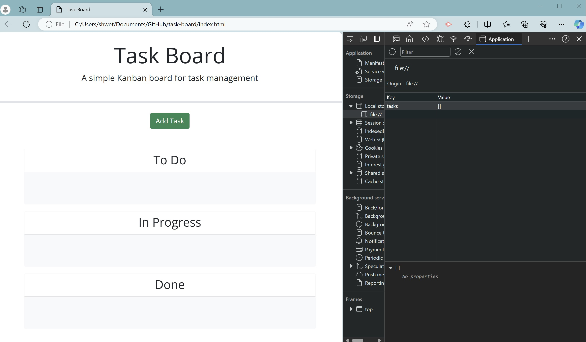
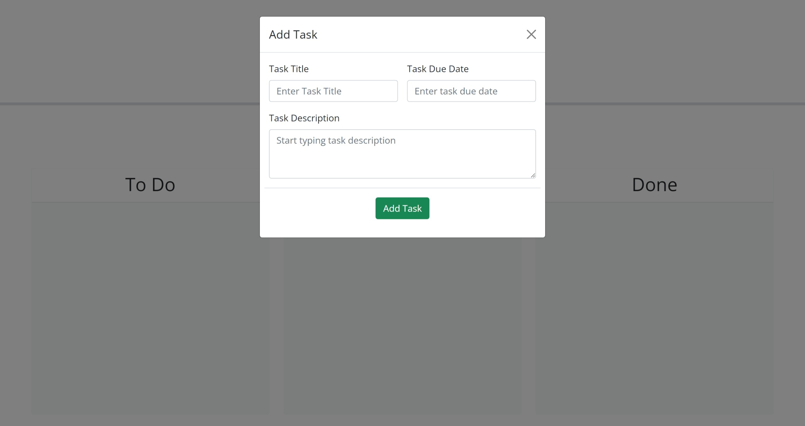
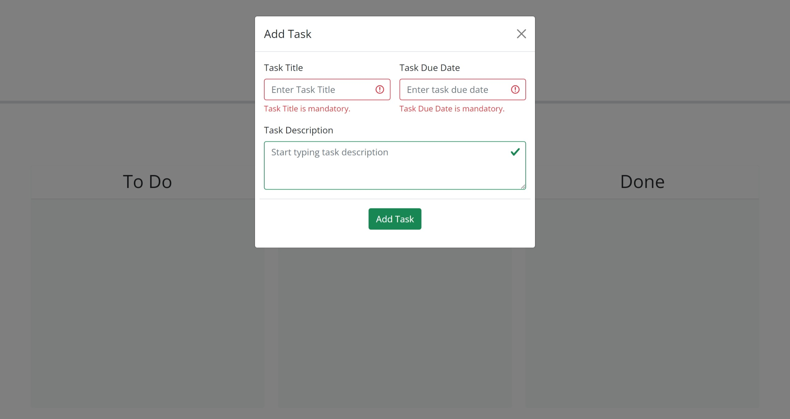
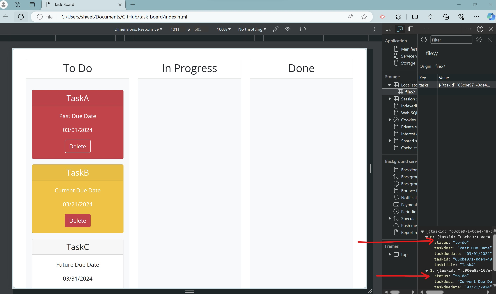
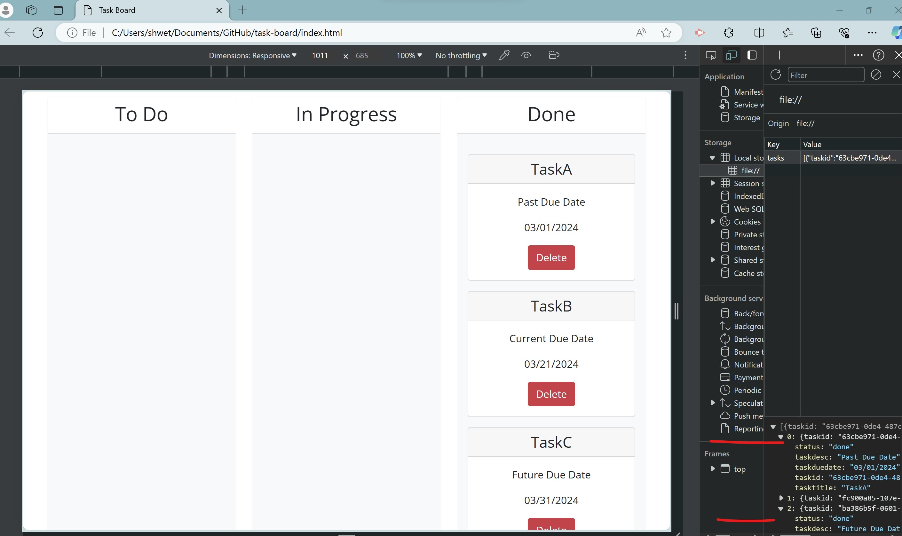
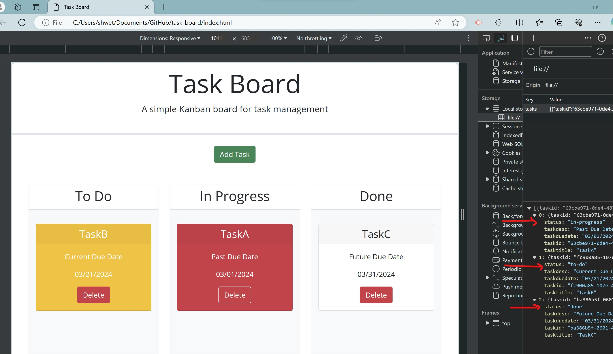

# task-board

## Description

- This application provides a task board for the team to manage project tasks. 
- It includes building modal forms so user can add various tasks, track the progress of tasks and delete the tasks.
- The implementation of this project helped apply my knowledge on html, css, jquery, github for repostitory management, use of third party apis like bootstrap components, jQuery UI Widgets, DayJS

## Table of Contents 

- [Installation](#installation)
- [User Story](#userstory)
- [Usage](#usage)
- [Acceptance Criteria](#acceptancecriteria)
- [Tests](#tests)
- [Credits](#credits)
- [License](#license)

## Installation

Follow these instructions to create your project and deploy it to GitHub Pages:

1. Create a new repository on your GitHub account and clone it to your computer.

2. When you're ready to deploy, use the git add, git commit, and git push commands to save and push your code to your GitHub repository.

3. Navigate to your GitHub repository in the browser and then select the Settings tab on the right side of the page.

4. On the Settings page, select Pages on the left side of the page. On the GitHub Pages screen, choose main in the dropdown under Branch. Click the Save button.

5. Navigate to <your-github-username.github.io/your-repository-name> and you will find that your new webpage has gone live! For example, if your GitHub username is "lernantino" and the project is "css-demo-site", then your URL would be <lernantino.github.io/css-demo-site>.


## User Story 

```md
AS A project team member with multiple tasks to organize
I WANT a task board 
SO THAT I can add individual project tasks, manage their state of progress and track overall project progress accordingly
```

## Usage

Link for the repository : 

https://github.com/shwetakadam5/task-board

Link for the webpage : 

https://shwetakadam5.github.io/task-board/

**Landing page /local storage:**



**Add Task Modal:**



**Add Task Error Messages:**



**Task cards Status : to-do  colored task card by : due date :**



**Task cards Status :in-progress**


**Task cards Status :done**



**Task cards : Displayed in all lanes with status**



**Delete Task cards demo and local storage**


## Acceptance Criteria

```md
GIVEN a task board to manage a project
WHEN I open the task board
THEN the list of project tasks is displayed in columns representing the task progress state (Not Yet Started, In Progress, Completed)
WHEN I view the task board for the project
THEN each task is color coded to indicate whether it is nearing the deadline (yellow) or is overdue (red)
WHEN I click on the button to define a new task
THEN I can enter the title, description and deadline date for the new task into a modal dialog
WHEN I click the save button for that task
THEN the properties for that task are saved in localStorage
WHEN I drag a task to a different progress column
THEN the task's progress state is updated accordingly and will stay in the new column after refreshing
WHEN I click the delete button for a task
THEN the task is removed from the task board and will not be added back after refreshing
WHEN I refresh the page
THEN the saved tasks persist
```

## Tests

**Test 1**
- Click on the Add Task button on Task Board page:  
    User will be presented with a Add Task modal to enter the task details.
    The following task details can be provided 
    Task Title : Mandatory input. Text box.
    Task Due Date : Mandatory input and datepicker to choose date. Text box.
    Task Description : Non mandatory input. Text area.
    X button : In header of the modal to close
    Add Task button : In footer of the modal : Persists and displays task on the task board by closing the modal.

**Test 2**
- Click on the X button avaialable on the header of Add Task Modal :
    Closes and displays the task board.

**Test 2**
- Click on the Add Task button available on the footer of Add Task Modal :
    Validates the form inputs
    If validation fails displays errors :
         Task Title is mandatory.
         Task Due Date is mandatory.
    If validation successful persists the task details in local storage and displays the task card in the To Do lane.
    Yellow color card : If the task due date is current.
    Red color card : If the task due date is past.
    White color card : If the task due date is future.

**Test 3**
- Click on the Delete Task button available on the Task Card:
    Deletes the task details from local storage and updates the task board page.


**Test 4**
- User can Drag and drop the task card across lanes.
    - If user drags and drops the task card from to do ->  in progress : The status of the task is updated to "in-progress" and the task is added in the In Progress task lane.
    - If user drags and drops the task card from to do ->  done: The status of the task is updated to "done" and the task is added in the Done task lane. The color of the task card is updated to white.
    - If user drags and drops the task card from done ->  to do : The status of the task is updated to "to-do" and the task is added in the To Do task lane. The color of the task card is updated based on the due date.
    - If user drags and drops the task card from done ->  in progress : The status of the task is updated to "in-progress" and the task is added in the In Progress task lane. The color of the task card is updated based on the due date.
    - If user drags and drops the task card from in progress ->  done : The status of the task is updated to "done" and the task is added in the Done task lane. The color of the task card is updated to white.
    - If user drags and drops the task card from in progress ->  to do : The status of the task is updated to "to-do" and the task is added in the To Do task lane. The color of the card is retained as per the due date

**Test 5**
- All the user inputs have default text displayed, which can be updated by the user

**Test 6**
- Hover on the Add Task Button : Hover text will display "Click here to Add Task"
- Hover on the X Button : Hover text will display "Click here to Close"
- Hover on the Task Title input : Hover text will display "Enter the task title here"
- Hover on the Task Due Date input : Hover text will display "Enter the task due date here"
- Hover on the Task Description input : Hover text will display "Enter the task description here"

**Test 7**
- Check appropriate headers are displayed for every section.

## Credits

_List your collaborators, if any, with links to their GitHub profiles:_ NA

_If you used any third-party assets that require attribution, list the creators with links to their primary web presence in this section:_

https://getbootstrap.com/docs/5.3/getting-started/introduction/
https://jqueryui.com/
https://day.js.org/

_If you followed tutorials, include links to those here as well :_ NA


## License

MIT
